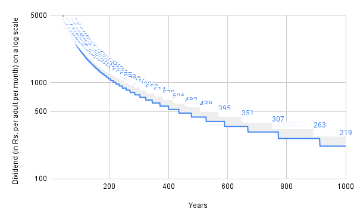

**KhaMBa Wiki**

April 7, 2022 (last updated August 22, 2022)

Author: [Vinamr Sachdeva](https://vinamrsachdeva.github.io)

**Disclaimer:** This wiki is under construction. A lot of data might be straight up incorrectly interpreted, so read at your own peril. I update as soon as I learn, so feel free to point out mistakes by sending an email at <vinamrsachdeva144@gmail.com> or by tweeting to me at @vinamrsachdeva or @INWealthWatch. Thousand thanks in advance.

This is an independent initiative from me and I do not receive any kind of direction from the authors of the proposal.

[**Contents](#_663ihv3jafd4)	**1****

[**A. Introduction](#_oykr9a4vo410)	**1****

[**B. Draft of the Gazette Notification](#_544r9le6hnol)	**2****

[**C. Estimate](#_aag75j9imgmz)	**2****

[1. Minerals](#_3alg2j42e2rh)	2

[1.1 Methodology: Existing mineral royalty collections](#_ove8nb3vr7bv)	2

[1.2 Methodology: Mining industry production data](#_wh2b9qricm0b)	3

[1.3 Methodology: Mineral reserve data](#_d8eddproal5g)	3

[2. Public Land](#_lkbzfrtvf0za)	4

[3. ](#_xgoi238b1407)[PSE](#_xgoi238b1407)[s](#_xgoi238b1407)	6

[4. Electromagnetic Spectrum](#_huv8i11s0ou)	6

[**D. Impact](#_kmmq5778x3fb)	**7****

[1. Additional income](#_2ybdjrqagajc)	7

[1.1 Total additional income for citizens & military](#_3ywwsn82ettr)	7

[1.2 % increase in income of Indian households](#_hiwnlif2453f)	7

[2. Real estate market](#_cgd0b3pj43sw)	7

# **A. Introduction**
The purpose of this wiki is to estimate the dividends we can issue to citizens from the wealth owned by all Indian citizens without selling even a square inch of land or even a single tonne of mining rights.

Some 23 years ago, Rahul Mehta, a Gujarat-based software developer and politician, came up with a proposed law that he named “Kanij Munafa Bantwara Proposal” (with its literal English translation being Mineral Profits Division Proposal) or KhaMBa for short[^1]. This proposal would allow two-thirds of the royalty payments from mining and wireless spectrum, rent collected from surplus public land and profits of PSEs would be dispensed as monthly payments to all Indians. The remaining third would be allocated for the military. This idea is inspired from Thomas Paine’s famous essay *Agrarian Justice*. 
# **B. Draft of the Gazette Notification**
The law draft prepared by Rahul Mehta and Pawan Sharma does not need to be passed in Parliament and can be directly issued as a notification in the Official Gazette by the Prime Minister.

Hindi draft authored by[Rahul Mehta](https://facebook.com/mehtarahulc),[Pawan Sharma](https://www.facebook.com/pawan.jury): [PDF](https://drive.google.com/file/d/1J_s0SaUlHkqmfeVkR15leuaebtXhehIf/view)

English translation by[Kushagra Yadav](https://www.facebook.com/kushagra.y): [Web](https://vinamrsachdeva.github.io/citizens-dividend/draft)
# **C. Estimate**

|**Asset**|**Income as**|**Total per year (in Rs. lakh crores)**|
**Estimate A**

**(Rs. per adult per month)**
|
**Estimate B**

**(Rs. per adult per month)**
|
| :-: | :-: | :-: | :-: | :-: |
|Minerals|Royalties|2.5|220|2200|
|Public Land|Rent|10|880|440|
|PSEs|Profits|2|175|175|
|EM Spectrum|Royalties|0.4|35|35|
|**Total Income**|**1310**|**2850**|
##
## **1. Minerals**
### **1.1 Methodology: Existing mineral royalty collections**
Gautam[^2] finds, by looking at government data, that both the Central and State governments receive ~Rs. 50,000 crores as royalties per year. This comes at around Rs. 45 per adult per month. But there are reasons for why I think we can avail more royalties from minerals.

1. Any attempt at opening a mining company will involve you (1) bribing the licensing authority (E.g. Coal Minister for mining coal) and/or (2) being connected with local gangsters. The licensing authority’s arbitrary decision on granting you mining license (influenced by his nexus with existing mining companies) and the role of mafia make mining a closed industry. A closed industry can never have fair auctions, the auctioneer will always get robbed in broad daylight. [^3] is an observation by Rahul Mehta of how mining auctions are rigged. Making mining an open industry by removing such crony-favorable licensing laws, cracking down on mafia (using nexus-free jury trials) and allowing mining PSEs to participate in all auctions will increase competition in the industry and drive up royalty rates in auctions.
1. Conversations with staff working at mining companies reveals that only 1-50% of mining is on-books (being conducted legally) and so the government isn’t receiving royalties for the rest of the illegal mining (50-99% of total). Hence, as the government takes steps to reduce illegal mining (primarly by using Jury Court and the political demand created from KhaMBa itself) this royalty rate will increase by anywhere between [no increase] to [anywhere between 2x and 100x depending on the specific mineral].

**Note:** This figure of Rs. 50,000 excludes profits of mining PSEs such as Coal India Ltd, but the other methodologies include the profits of mining PSEs.
### **1.2 Methodology: Mining industry production data**
#### **1.2.1 Calculating royalties and profits as a percentage of Mining-sector GDP**
[Find if mining-sector GDP includes anything other than revenues from mineral production]

Annual on-book mining contribution to GDP = approx 2.5% of GDP[^4]

GDP of India in current prices = approx Rs. 200 lakh crore[^5]

Annual on-book mining revenue = approx Rs. 5 lakh crore

Now, mineral royalties/profits that we can get from KhaMBa depends on the royalty rate / profit % of mining PSEs and off-book mining.

We can get Market Price of Mineral - Cost of Mining as dividends if we use competitive bidding and mining PSEs for all kinds of mining. If all companies in auctions are private companies then the maximum royalty we can get is Market Price of Mineral - Cost of Mining - Profit of private company. If we have PSEs also participating in the auctions, then I’m pretty confident that they can out bid nearly all private mining companies since their motive is not generating profits and so they can bid Market Price of Mineral - Cost of Mining as royalty. 

Mining costs can sometimes be an order of magnitude less than the market price of the mineral. E.g.

1. Cost of mining coal per tonne is ~Rs 800 to 1000[^6] and the international market price of coal goes upto Rs. 3,000 to Rs. 20,000 (depending on quality) i.e. 3 to 20 times the cost. 
1. Cost of oil production can vary from $3 to $20 per barrel[^7] and its price has fluctuated from $16 to $116 per barrel in the last 10 years[^8] i.e. approximately 5 to 40 times the cost

Say we take a conservative estimate of getting 50% of the market price as royalties, then if there is 0 off-book production, then we'll get ~Rs. 220 per adult per month as mineral royalties. The total dividend that mineral royalties can contribute if off-book production is > 0 will be directly proportional to the level of off-book production. E.g. If off-book production is equal to on-book production and the government is able to curb illegal mining, we can get Rs. 440 per adult per month.

[Insert graph]
#### **1.2.2 Estimating annual mineral production**
[Table under construction]

Link to spreadsheet: <https://docs.google.com/spreadsheets/d/1cLnfyjt_eGLoaYhmakdVCHE_pOR3wOBBrT49dZBXI30/> 

|**Name of Resource**|
**Annual Production**

**in Million Tonnes**

**(2019-20)**
|
**Price (in Rs.**

**per tonne)**
|
**Value (in Rs.**

**crores)**
|**Method of Pricing**|
**Profit**

**(in Rs. crores)**
|
**Source**

**for**

**production**
|
**Source**

**for**

**price**
|
**Source**

**for**

**profit**
|
| :-: | :-: | :-: | :-: | :-: | :-: | :-: | :-: | :-: |
|**Hydrocarbon**|||||||||
|Coal|730.87|3000|219261|National Coal Index|146174|[\[1\]](https://coal.gov.in/en/major-statistics/production-and-supplies)|[\[2\]](https://coal.nic.in/nominated-authority/national-coal-index)||
|Lignite|||||||||
|Crude Oil|32.2|27825.6|89598.432|International Price|48872|[\[7\]](https://www.outlookindia.com/business/oil-crude-oil-india-s-crude-oil-production-drops-by-2-6-in-fy22-news-192378)|[\[8\]](https://www.macrotrends.net/2516/wti-crude-oil-prices-10-year-daily-chart)||
|Natural Gas|11007.58162|0.0120312504|13.24349707|International Price|||||
||||**308872.6755**||**195046**||||
|**Major Minerals/Metals**|||||||||
|Antimony|||||||||
|Asbestos|||||||||
|Barytes|||||||||
|Bauxite|20.46|1500|30690|Average Sale Price||[\[x\]](https://www.statista.com/statistics/667035/india-bauxite-production-volume/)|[\[x+1\]](https://ibm.gov.in/?c=pages&m=index&id=1522)||
|Betonite|||||||||
|Borax|||||||||
|Calcite|||||||||
|Chromite|||||||||
|Copper|||||||||
|Diamond|||||||||
|Diaspore|||||||||
|Diatomite|||||||||
|Dolomite|||||||||
|Felspar|||||||||
|Fireclay|||||||||
|Fluorite|||||||||
|Fuller Earth|||||||||
|Garnet|||||||||
|Granite|||||||||
|GyPSEm|||||||||
|Titanium|||||||||
|Iron Ore (Hematite)|203.09|4000|81236|Average Sale Price|20309|[\[y\]](https://www.statista.com/statistics/667485/india-iron-ore-production-volume/)|[\[y+1 a\]](https://ibm.gov.in/?c=pages&m=index&id=1522),[\[y+1 b\]](https://www.thehindubusinessline.com/companies/sluggish-steel-demand-poor-buyer-response-drags-down-iron-ore-prices-by-20-in-india/article65500653.ece)|[\[y+2\]](https://www.mining.com/global-iron-ore-production-growth-to-accelerate-until-2026-report/)|
|Iron (Magnetite)|||||||||
|Kyanite|||||||||
|Sillimanite|||||||||
|Andalusite|||||||||
|Lead & Zinc|||||||||
|Limestone|||||||||
|Magnesite|||||||||
|Manganese|2.9||0|Global Price||[\[z\]](https://www.statista.com/statistics/667555/india-manganese-ore-production-volume/)|[\[z+1\]](https://www.statista.com/statistics/247633/manganese-price-forecast/)||
|Marble|||||||||
|Mica|||||||||
|Molybdenum|||||||||
|Nickel|||||||||
|Ochre|||||||||
|Platinum|||||||||
|Potash|||||||||
|Quartz and Silica|||||||||
|Quartizite|||||||||
|Silver|||||||||
|Talc/Steatite/Soapstone|||||||||
|Tin|||||||||
||||**111926**||**20309**||||
|**Radioactive Substances**|||||||||
|Thorum|||||||||
|Uranium|||||||||
||||**0**||**0**||||
||||||||||
||||**420798.6755**||**215355**||||
||||**369.1216452**||**188.9078947**||||

### **1.3 Methodology: Mineral reserve data**
Kundu[^9] estimates the total value of all explored hydrocarbons (coal, crude oil, natural gas, etc.) and major mines and minerals in India to be at ~Rs. 5,011.6 lakh crore using the Indian Minerals Book 2011 (published by Indian Bureau of Mines, Government of India). Now, as time progresses we may find more mines and the market value of minerals also changes, so this price will change. But for now, I’ll assume only those mines which have been explored and 2011 prices which Sridhar had used, and give a range of estimates for the dividends (on a log scale) we can get if we extract the minerals in a range of 1 to 1000 years in the following graph:

## **2. Public Land**
Total value of surplus public land = Rs. 340 lakh crore. I assumed a rent of 3% per annum for this estimate (which is roughly the market rate).

A company registered by the name of[Free A Billion Pvt. Ltd.](https://www.zaubacorp.com/company/FREE-A-BILLION-PRIVATE-LIMITED/U72900MH2012PTC226614) set out some researchers to estimate surplus public land. One of their sister organizations says that they estimated total surplus public land (of both the Central and State governments) to be at Rs. 340 lakh crore.[^10] Adding to this estimate, they say

|“The data on the unused public lands was collected by researchers at Free A Billion from authoritative governmental and non-governmental sources. These sources include Parliamentary Questions, data collected by various NGOs and think-tanks, government databases, information available from various Ministries and Departments of the Government of India.”|
| :- |
I don’t have full faith on this estimate because they have not released the exact sources they have used but I think their estimate makes sense and now I’ll explain why I think so.

A few years ago, the Central government actually came up with a figure of how much land 41 of their 51 ministries and 22 of over 300 PSEs own, and it was 13,505 square kilometers.[^11] For reference, the total area of Delhi is 1,483 square kilometers. So the Central government owns land equal to ~9 Delhi’s.

If, say, 100% of it is vacant (it isn’t, but say hypothetically), then the value of this property will have to be ~Rs. 2,500 per square feet for the total land to be valued at Rs. 340 lakh crore. A lot of Central government’s land is in prime areas of New Delhi and state capitals where property rates can go upto 20 times this rate. If they are, on an average, 5 times this rate of Rs. 2,500 per square feet, even 20% vacant land will make the value of surplus land at Rs. 340 lakh crores. On top of that, this figure still misses 10 Union ministries, some MoD land (for security reasons), more than 280 Central PSEs and all the land owned by State governments and their PSEs. Hence, I’d guess even if 10% of the total public land is vacant, the value of the total surplus public land can be close to Rs. 340 lakh crores, or maybe even more.

Now, we don’t know for sure if we have 10% land lying vacant because the government hasn’t released the data but we do have some idea of how muhc could be vacant based on data on some ministries and departments. According to the Comptroller and Auditor General of India[^12]

|“The Ministries of Railways and Defense, respectively, have 43,000 hectares and 32,780 hectares of land lying vacant, without even any proposed use […] the 13 major port trusts have 14,728 hectares of land lying idle.”|
| :- |
To be consistent with the units I have been using, the Ministry of Railways has 430 square kilometers, the Ministry of Defense has 327.8 square kilometers and the port trusts have 147.28 square kilometers of vacant unutilised land. This totals to 905.08 square kilometers, or 6.7% of total declared land of the Central government (13,505 square kilometers). For reference, the Ministry of Railways declared having 2,929.6 square kilometers of land in total, so if 430 of it is vacant then that makes 14.6% of Ministry of Railways land vacant. One important point to note here is that railway land, military bases and ports aren’t in the prime areas of cities unlike other land owned by the government, so we’ll have to look for vacant land of other ministries to come to a good estimate.

This excludes potential royalties from land leased currently. E.g. Government of India gave 4,799.09 acre of prime land to, its private sector partner, DIAL for development of Delhi airport for a paltry lease rent of Rs. 4,79,909 per year for 60 years.[^13] Similarly, other cronies also grab public land during auctions at the price of peanuts. One way in which this is done is: the government officer responsible for cutting the plots to be auctioned will make sure that all plots are large enough to exclude most Indians from participating in the auction. The land rent received will increase once these backroom deals with cronies end.

As this surplus public land comes for sale into the real estate market, it’ll drive down the cost of land and also rent and for this reason I have taken a range of 50% of current price to 100% of current price while calculating the income from land rent. This will reduce the land rent citizens will get via this law but will indirectly benefit citizens as they’ll be able to buy/rent real estate at a proportionaly cheaper cost.
## **3. PSEs**
For FY 2021, profits of Central PSEs totaled to Rs. 1.89 lakh crore.[^14] This does not include profits of State Government PSEs.

PSEs riddled with inefficiency and corruption reduce the net profit citizens (the real shareholders of PSEs) can receive as dividends. Hence, citizens’ direct control over their directors by giving citizens’ the right to elect and expel directors anytime will reduce this corruption and inefficiency and will increase their profits and the amount that citizens’ can take as income. For this reason, I have taken a range of 100% to 200% of current PSE profits while calculating the income.
## **4. Electromagnetic Spectrum**
I took an average of the Department of Telecommunication’s annual non-tax revenue from 2012 to 2017, which came out around Rs. 40,000 crore.[^15] This will change widely as and when new bands are auctioned.

Some of this Rs. 40,000 crore would have come from profits of PSEs under DoT but it won’t change the total amount by much since most DoT PSEs are running at losses for. For now I’ve assumed all of it as spectrum royalties but I’ll update this figure soon so that it is more accurate.
# **D. Impact**
## **1. Additional income**
### **1.1 Total additional income for citizens & military**

|**For**|**Estimated total**|
| :-: | :-: |
|**Citizens (67% of total)**|**per adult per month**|
1 Indian household = 4.8 members: National Family Health Survey (NFHS)

~60% of Indians are adults: “India: Age distribution from 2011 to 2021”. Statistia. <https://www.statista.com/statistics/271315/age-distribution-in-india/>

**per household [^16] [^17] per year**
|
||Rs. 508 to Rs. 1,731|Rs. 18,288 to Rs. 62,316|
|**Ministry of Defense (33% of total)**|Rs. 2.9 lakh crores to Rs. 6.5 lakh crores **per year**|
###
### **1.2 % increase in income of Indian households**
If we receive something in the middle, say Rs. 1,000 per adult per month and if, say an average Indian household has 1 earning member earning Rs. 10,000 a month and consists of 3 adults and 2 children, then that household will see their income rise by 10%. Now, I’ll show the % increase in incomes for 2 income groups which comprise majority of the Indian population who also happen to be the greatest beneficiaries of KhaMBa:

|
Consumer Pyramids Household Survey (CPHS)

**Annual household income [^18]**
|**Share of total households**|**Minimum % income increase**|**Maximum % income increase**|
| :-: | :-: | :-: | :-: |
|less than Rs. 1,00,000|poorest 16.6%|More than 18%|More than 60%|
|between Rs. 1,00,000 and Rs. 2,00,000|next 45%|More than 9%|More than 30%|

## **2. Real estate market**

[^1]: It was initially named Equal Allowance System, then changed to Mineral Royalties for Commons and the Military, then to Direct Deposit of Mineral Royalties to Citizens Account and the Military, then to Dhanvapsi Passbook, and is now being called Khanij Munafa Bantwara Proposal by him. We’ll refer to it as KhaMBa throughout this booklet.
[^2]: Gautam, Vipul. “A post on royalties from minerals under Central and State governments.” 3 April 2022.<https://www.facebook.com/groups/179774627122206/posts/502769448156054/>
[^3]: Mehta, Rahul. How mineral royalty theft is implemented?. May 5 2020.<https://www.facebook.com/mehtarahulc/posts/pfbid022LcaSvhXHChPqyEqb6JThKMKceL3VYtSmqEaTdE6Ghd4Hck87gJUhrmhxCtZzXEDl>.
[^4]: “Sector-wise GDP of India.” Statistics Times. <https://statisticstimes.com/economy/country/india-gdp-sectorwise.php>.
[^5]: “GDP (current US$) - India.” The World Bank. <https://data.worldbank.org/indicator/NY.GDP.MKTP.CD?locations=IN>.
[^6]: Rakshit, Avisek. “Coal India to keep prices lower than pvt miners under coal liberalisation”. 31 March 2018. <https://www.business-standard.com/article/companies/coal-india-to-keep-prices-lower-than-pvt-miners-under-coal-liberalisation-118033000582_1.html>
[^7]: “Cost of oil production in the world”. Kostaka Media. <https://kosatka.media/en/category/neft/analytics/sebestoimost-dobychi-nefti-v-mire> 
[^8]: “Crude Oil”. Trading Economics. <https://tradingeconomics.com/commodity/crude-oil> 
[^9]: Kundu, Sridhar, “A Note on the Estimated Value of Government-Owned Natural Resources in India”. CBGA. 2014.<http://www.cbgaindia.org/wp-content/uploads/2016/03/Estimated-Value-of-Government-Owned-Natural-Resources-in-India.pdf>.
[^10]: “Public Wealth Wiki.” landwiki, . 21 Oct 2019, 07:52 UTC. 5 Aug 2022, 16:42.<http://wiki.dhanvapasi.com/index.php?title=Public_Wealth_Wiki&oldid=789>.
[^11]: “How much land does the Indian govt own? About 9 times the size of Delhi”. Hindustan Times. 30 October 2017.<https://www.hindustantimes.com/india-news/how-much-land-does-indian-govt-own-officials-building-inventory-railways-biggest-landowner/story-NTUmFHp2xFXoB2lZRbv5TP.html>.
[^12]: Singh, Ram. “The problem of land hoarding”. 8 January 2018.<https://www.thehindu.com/opinion/op-ed/the-problem-of-land-hoarding/article22391966.ece>.
[^13]: Headlines Today Bureau. “CAG pulls up aviation ministry over land allotment to DIAL; values loss at Rs 1.63 lakh crore”. 23 May 2012.<https://www.indiatoday.in/india/north/story/delhi-airport-land-deal-scam-cag-aviation-ministry-103088-2012-05-23>.
[^14]: “Profit of PSEs surges over 37% to Rs 1.89 lakh cr in FY21: Govt”. Times Now. 15 March 2022.[https://www.timesnownews.com/business-economy/companies/profit-of-PSEs-surges-over-37-to-rs-1-89-lakh-cr-in-fy21-govt-article-90219227](https://www.timesnownews.com/business-economy/companies/profit-of-psus-surges-over-37-to-rs-1-89-lakh-cr-in-fy21-govt-article-90219227).
[^15]: Department of Telecommunications. “Annual Report”. 2012-2017.<https://dot.gov.in/reports-statistic/2471>.
[^16]: 
[^17]: 
[^18]: 
